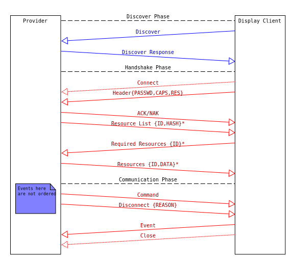

# Dunstblick Protocol Definition

The document uses the following special terms:
- *display client*: A program or device the user can use to interact with the system
- *application* or *provider*: A program that provices a user interface, this can be operated with a *display client*
- *user*: A person that wants to interact with an *application*

## Display Server Connection

The following diagram shows the rough structure of the initial communication 
handshake:



### Discovery Protocol

> TODO: Continue dunstblick discovery protocol documentation

### Display Connection

The display client connects to the previoulsy announced TCP port and sends the following packet:

```
magic            : [4]u8 = { 0x21, 0x06, 0xc1, 0x62 }
protocol_version : u16 = 1
name             : [32]u8
password         : [32]u8
capabilities     : u32
screen_size_x    : u16
screen_size_y    : u16
```

- *magic* and *protocol_version* are fixed values that must have the values above.
- *name* is the zero-padded string of the display client. This can either be the device
name, application name or another name that may help the user identify the display client.
- *password* is a zero-padded connection password that may be used to authenticate the user
  to the application.
- *capabilities* is a bit mask that specifies what features are available on the dispay client.
- *screen_size_x* and *screen_size_y* define the initial size of the screen in pixels assuming that the screen has 96 DPI.

> TODO:  Continue dunstblick protocol documentation